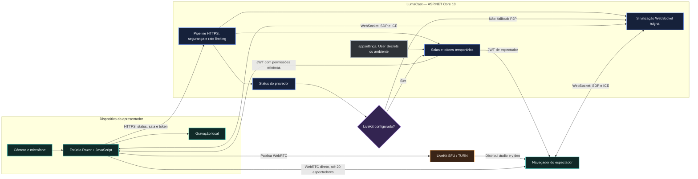

# LumaCast

Aplicação web para criar transmissões ao vivo usando a câmera e o microfone do dispositivo. O backend é construído com ASP.NET Core 10 e entrega dois modos de transporte:

- **LiveKit SFU (recomendado para produção):** oferece sinalização, TURN e distribuição de mídia escalável;
- **WebRTC P2P:** fallback automático para desenvolvimento e salas pequenas quando o LiveKit não está configurado.

## Funcionalidades

- pré-visualização da câmera antes de iniciar a transmissão;
- seleção de câmera, microfone e qualidade de vídeo;
- link compartilhável e página exclusiva para espectadores;
- contagem de espectadores conectados;
- gravação local da transmissão com download ao encerrar;
- tokens LiveKit separados para apresentador e espectador;
- chave do apresentador gerada de forma criptograficamente segura;
- fallback WebRTC com sinalização WebSocket interna;
- endpoint de saúde, rate limiting e cabeçalhos HTTP de segurança.

## Tecnologias

| Área | Tecnologia |
| --- | --- |
| Plataforma | .NET 10 LTS e C# 14 |
| Backend | ASP.NET Core 10, Razor Pages e Minimal APIs |
| Streaming | WebRTC e LiveKit |
| SDK do servidor | `Livekit.Server.Sdk.Dotnet` 1.2.2 |
| Cliente LiveKit | `livekit-client` 2.21.0 |
| Testes | MSTest 4.3.3, Microsoft Testing Platform e Microsoft Code Coverage |
| Qualidade | Analisadores .NET, cobertura mínima de 80%, avisos como erros e documentação XML |
| Automação | GitHub Actions |

As versões dos pacotes são centralizadas em `Directory.Packages.props`. O SDK utilizado pelo projeto é controlado por `global.json` e as dependências ficam fixadas pelos arquivos `packages.lock.json`.

## Solução e estrutura

`LumaCast.slnx` é o arquivo de solução no formato XML moderno do .NET e contém três projetos:

```text
LumaCast.slnx
├── LumaCast.csproj                 Aplicação ASP.NET Core
├── tests/
│   └── LumaCast.Tests.csproj       Testes unitários e de integração
└── tools/
    └── LumaCast.CoverageGate.csproj Verificador da cobertura mínima
```

Principais diretórios:

- `Configuration/`: opções tipadas e validação da configuração LiveKit;
- `Endpoints/`: endpoints HTTP do LiveKit e sinalização WebSocket;
- `Infrastructure/`: registro de dependências, rate limiting e segurança HTTP;
- `Pages/`: estúdio, player e páginas Razor;
- `Services/`: tokens, registro de salas e coordenação P2P;
- `tests/LumaCast.Tests/`: testes de unidade e integração;
- `tools/LumaCast.CoverageGate/`: quality gate multiplataforma para relatórios Cobertura;
- `wwwroot/`: JavaScript, CSS e demais arquivos do navegador.

## Pré-requisitos

- SDK .NET `10.0.400` ou uma feature band compatível aceita pelo `global.json`;
- navegador moderno com suporte a WebRTC;
- HTTPS para câmera e microfone quando o acesso não ocorrer por `localhost`;
- projeto no LiveKit Cloud ou servidor LiveKit próprio para o modo escalável.

Confirme o ambiente instalado:

```bash
dotnet --version
dotnet sln LumaCast.slnx list
```

## Configuração do LiveKit

As chaves estão declaradas no `appsettings.json` sem valores reais:

```json
{
  "LiveKit": {
    "Url": "",
    "ApiKey": "",
    "ApiSecret": ""
  }
}
```

| Chave .NET | Variável hierárquica | Variável compatível | Obrigatória |
| --- | --- | --- | --- |
| `LiveKit:Url` | `LiveKit__Url` | `LIVEKIT_URL` | Sim, com `ws://` ou `wss://` |
| `LiveKit:ApiKey` | `LiveKit__ApiKey` | `LIVEKIT_API_KEY` | Sim |
| `LiveKit:ApiSecret` | `LiveKit__ApiSecret` | `LIVEKIT_API_SECRET` | Sim |

Os três valores devem ser fornecidos em conjunto. Se todos estiverem vazios, a aplicação inicia normalmente no modo P2P. Se apenas parte da configuração for informada ou a URL for inválida, a inicialização falha com uma mensagem de validação.

### Desenvolvimento com User Secrets

Esta é a forma recomendada de configurar credenciais localmente sem modificar arquivos versionados:

```bash
dotnet user-secrets set "LiveKit:Url" "wss://seu-projeto.livekit.cloud" --project LumaCast.csproj
dotnet user-secrets set "LiveKit:ApiKey" "sua-api-key" --project LumaCast.csproj
dotnet user-secrets set "LiveKit:ApiSecret" "seu-api-secret" --project LumaCast.csproj
dotnet user-secrets list --project LumaCast.csproj
```

Para remover as credenciais locais:

```bash
dotnet user-secrets clear --project LumaCast.csproj
```

### Variáveis de ambiente

Em produção, use um cofre de segredos ou variáveis do ambiente de execução:

```bash
export LiveKit__Url="wss://seu-projeto.livekit.cloud"
export LiveKit__ApiKey="sua-api-key"
export LiveKit__ApiSecret="sua-api-secret"
```

As variáveis legadas em letras maiúsculas mostradas na tabela também são aceitas e sobrescrevem os valores da seção. Nunca envie `ApiSecret` ao navegador nem salve credenciais reais no Git.

## Restaurar, compilar e executar

Restaure a solução usando as versões fixadas:

```bash
dotnet restore LumaCast.slnx --locked-mode
```

Compile todos os projetos:

```bash
dotnet build LumaCast.slnx --configuration Release --no-restore
```

Execute a aplicação em desenvolvimento:

```bash
dotnet run --project LumaCast.csproj --launch-profile https
```

Abra `https://localhost:7271`. O endereço HTTP `http://localhost:5008` também é criado pelo perfil, mas o HTTPS deve ser preferido para testar permissões de mídia.

Na primeira execução local, confie no certificado de desenvolvimento se necessário:

```bash
dotnet dev-certs https --trust
```

## Testes

A suíte cobre:

- criação, validação, encerramento e expiração de salas;
- permissões dos tokens de apresentador e espectador;
- falha segura quando o LiveKit não está configurado;
- leitura da seção `LiveKit` pela configuração da aplicação;
- ciclo completo dos endpoints de salas e tokens;
- sinalização WebSocket entre apresentador e espectadores;
- fallback offline e rejeição de conexões inválidas;
- renderização das Razor Pages;
- endpoint de status, health check e cabeçalhos de segurança.

Execute todos os testes pela solução:

```bash
dotnet test LumaCast.slnx --configuration Release
```

### Cobertura obrigatória

O arquivo `coverage.config.json` exige no mínimo **80% de cobertura de linhas e 80% de branches**. Atualmente, a suíte possui **96,61% de linhas e 84,69% de branches**.

Gere o relatório no formato Cobertura:

```bash
dotnet test tests/LumaCast.Tests/LumaCast.Tests.csproj \
  --configuration Release \
  --no-build \
  -- \
  --coverage \
  --coverage-output coverage.cobertura.xml \
  --coverage-output-format cobertura
```

Execute o mesmo quality gate usado pelo GitHub Actions:

```bash
dotnet run \
  --project tools/LumaCast.CoverageGate/LumaCast.CoverageGate.csproj \
  --configuration Release \
  --no-build \
  -- \
  coverage.config.json
```

O comando retorna código de erro quando qualquer métrica fica abaixo de 80%, bloqueando o workflow. O ruleset ativo da branch `main` exige o check `Build, test and coverage` aprovado e atualizado com a versão mais recente da branch antes do merge.

Valide dependências conhecidas como vulneráveis:

```bash
dotnet list LumaCast.slnx package --vulnerable --include-transitive
```

O workflow `.github/workflows/ci.yml` executa restauração em modo bloqueado, verificação de formatação, build, testes com cobertura, quality gate e auditoria de dependências em cada pull request.

## Documentação do código

As classes públicas e os métodos principais possuem comentários XML com resumo, parâmetros, retornos e condições de erro. A documentação é verificada durante o build porque os avisos são tratados como erros.

O arquivo XML gerado pode ser encontrado após a compilação em:

```text
bin/Release/net10.0/LumaCast.xml
```

## Endpoints

| Método | Caminho | Uso |
| --- | --- | --- |
| `GET` | `/api/livekit/status` | Informa se o provedor ativo é LiveKit ou P2P |
| `POST` | `/api/livekit/rooms` | Cria uma sala e devolve a chave do apresentador |
| `POST` | `/api/livekit/token` | Emite uma credencial temporária de participante |
| `POST` | `/api/livekit/rooms/{roomName}/end` | Encerra uma sala autenticada |
| `GET` | `/signal` | Estabelece a conexão WebSocket usada na sinalização P2P |
| `GET` | `/healthz` | Informa a saúde do processo |

## Arquitetura do streaming



No modo LiveKit, o backend cria a sala lógica e assina um token com permissões mínimas. O navegador envia a mídia para a SFU, que a distribui aos espectadores. O segredo da API permanece somente no servidor.

No modo P2P, o backend troca ofertas, respostas e candidatos ICE por WebSocket. Cada espectador recebe uma conexão direta do apresentador; por isso esse modo é limitado a 20 espectadores e deve ser usado apenas para desenvolvimento ou salas pequenas.

As salas ficam em memória e expiram após 12 horas. Para executar várias instâncias da aplicação, substitua o registro em memória por armazenamento distribuído e adicione autenticação de usuários.

## Publicação

Gere os artefatos otimizados:

```bash
dotnet publish LumaCast.csproj --configuration Release --output artifacts/publish
```

O ambiente de hospedagem deve fornecer HTTPS, encaminhar WebSockets e disponibilizar as três configurações LiveKit. Para gravação no servidor, retransmissão RTMP ou armazenamento permanente, configure o [LiveKit Egress](https://docs.livekit.io/home/egress/overview/).

## Práticas adotadas

- nullable reference types e implicit usings habilitados;
- formatação consistente definida no `.editorconfig`;
- C# 14 e SDK controlados centralmente;
- versões de pacotes centralizadas e lock files versionados;
- analisadores no nível `latest-recommended` e avisos tratados como erros;
- opções LiveKit tipadas, validadas na inicialização e cobertas por testes;
- `TimeProvider` para testes determinísticos de expiração;
- rate limiting por cliente em criação de salas, tokens e sinalização;
- Problem Details, health check e arquivos estáticos otimizados;
- CSP, Permissions Policy e outros cabeçalhos de proteção;
- mensagens WebSocket limitadas e comparação de chaves em tempo constante;
- cobertura mínima de 80% para linhas e branches, validada localmente e no CI;
- CI com formatação, build, testes, quality gate e auditoria de dependências.
